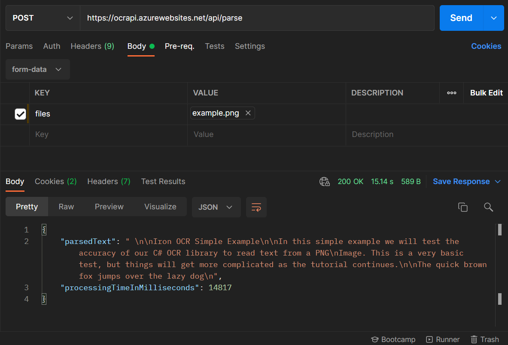

# OcrApi

## Endpoints

POST /api/parse with an image in the request body will return the parsed text and the time it took to parse the image.

Check out the [live demo](https://ocrapi.azurewebsites.net/api/home/)

## Requirements

- .NET 5 SDK

## Getting started

1. Install the [.NET 5 SDK](https://dotnet.microsoft.com/download)
2. Clone this repo using `git clone --depth=1 https://github.com/MaximilianHagelstam/ocrapi.git <YOUR_PROJECT_NAME>`
3. Move to the appropriate directory: `cd <YOUR_PROJECT_NAME>`.
4. Run `dotnet restore` to install dependencies.
5. Run `dotnet run` to start the app.

## License

This project is licensed under the terms of the [MIT](https://choosealicense.com/licenses/mit/) license.
